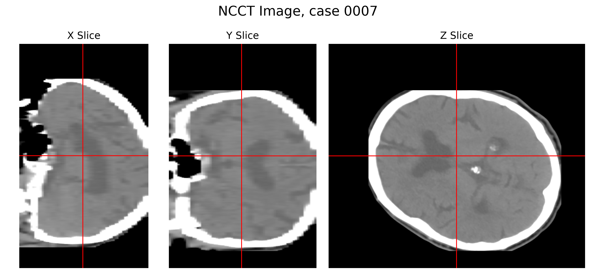
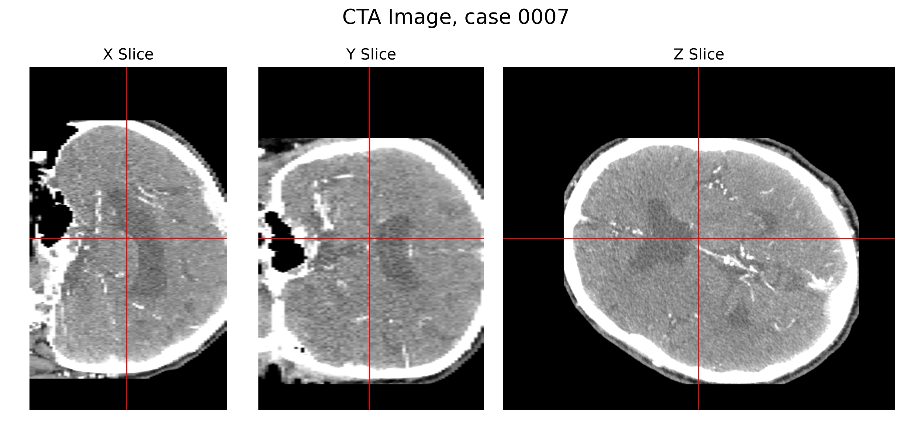
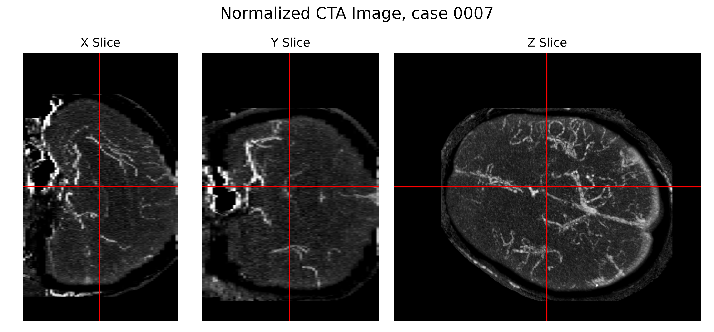
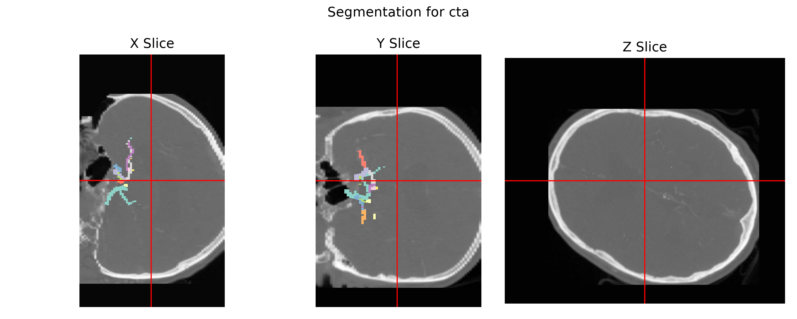
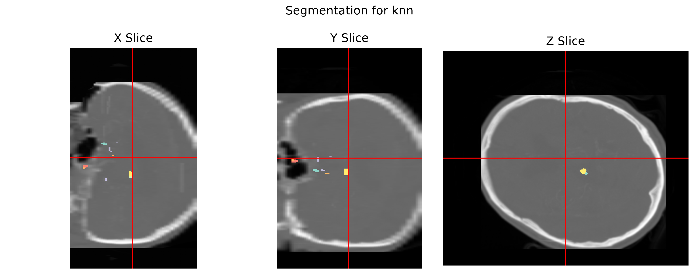
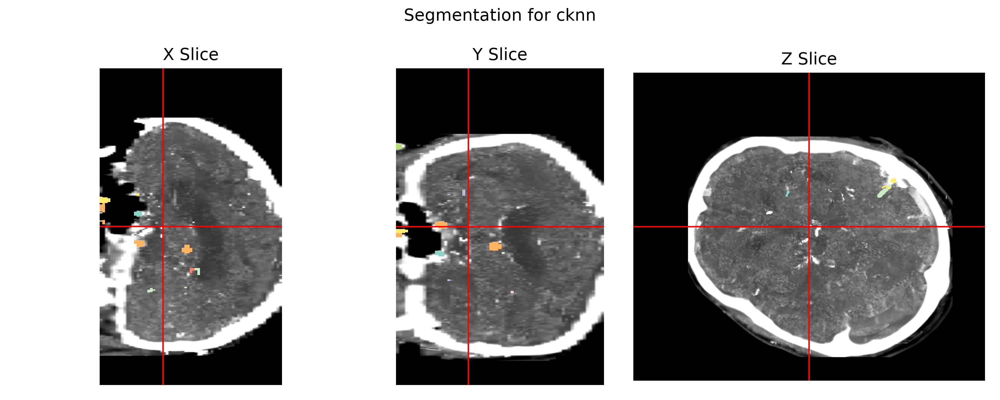

# Code install

This code has some mandatory dependencies - some that are only used for training and some that are used during evaluation. The repo is missing a toml file and cannot be installed, but all the scripts can be run in python module mode:
```
python -m scripts.<file name without .py>
```
similarly, all the notebooks rely only on relative imports. For the code to work, you must download the [training data](link.com), unzip it and move the folder nnUNet_raw into root.

### Training dependencies
* ``torch`` (cuda is hard coded, if you have cpu only, Ctr+F replace "cuda" with "cpu" in the entire repo will do the trick).
* ``monai`` (A deep learning + medical imaging library)
* ``matplotlib``


### Evaluation dependencies
* The [TopCoWSubmissions](https://github.com/fmusio/TopCoWSubmissions) library, which requires
* [nnDetection](https://github.com/MIC-DKFZ/nnDetection?tab=readme-ov-file#source) and [nnUNet](https://github.com/MIC-DKFZ/nnUNet/blob/master/documentation/installation_instructions.md#installation-instructions), which in turn have extra dependencies.


## Assumptions

I made a number of assumptions about the data and relevant applications.
1. The purpose of brain CTA is mainly to find topology changes (tears, blockages) and deformations (aneurysms, narrowing, malformations) to the vessels. 
2. Any measurement fluctuations in the soft tissue (<100 HU range) outside the vessel structure is not important for clinicians.
3. The registration is "perfect" in the sense that any deformation of the NCCT data will necessarily degrade the results. The optimal approximation to CTA conditioned on a known vascular system is simply to superimpose the vessels on top of the NCCT image.
4. I am not allowed to use any meta data as an input. The predictions must be made solely from the NCCT voxel values.

I propose the following pipeline.

## Data processing
Let $\{(x_n, y_n)\}_{n=1}^N$ denote the original data set, where $x_n\in \mathbb{R}^d$ are the NCCT images measured in HU , and $y_n\in \mathbb{R}^d$ the CTA images, also in HU. I define a data transform $T\colon \mathbb{R}^d \times \mathbb{R}^d\to \mathbb{R}^d\times \mathbb{R}^d$ with $(x,y)\mapsto (\tilde x, \tilde y)$, as follows.
1. Create a bone mask from $x$ by a gaussian blurring of a thresholding:
$$
    m_x = 1 -\Phi_\sigma\circledast\mathbf{1}_{[150, \infty)}(x),
$$
where the characteristic function acts voxel wise, and $\Phi_\sigma$ is a gaussian $2\sigma/p_x \times 2\sigma/p_y \times 2\sigma/p_z$ (rounded to nearest integer) filter with gaussian entries, and $p_x, p_y, p_z$ are the pixel widths extracted from the data header.

2. Create a masked difference of $x$ and $y$:
$$
    z = m_x \odot (y - x).
$$
The order of subtraction is important because we expect $y> x$.

3. For $x$, the interesting soft tissue is in the range $-30$ to $90$ HU and for $z$ it is $0$ to $400$ HU. I apply a normalization step and then clamp to $[-1, 1]$:
$$
    \hat x = \psi_{[-30,90]}(x), \; \hat y = \psi_{[0, 400]}(z)
$$
Where $\psi_{[a,b]}(x) = \mathrm{clamp}(\tfrac{2z-a-b}{b-a})$.


4. Interpolate the result to a $128 \times 128\times D$ grid using trilinear interpolation.
$$
    (\tilde x, \tilde y) = (P_{128}(\hat x), P_{128}(\hat y)),
$$
where $P_d$ trilinear interpolation to a $D\times d \times d$ sized grid. This was done to decrease the VRAM requirements during training.


The data transform is then 
$$
    T(x, y) = (P_{128}(\psi_{[-30,90]}(x)), P_{128}(\psi_{[0,400]}(m_x\odot (y -x)))).
$$
These are my input-output pairs for training. Below is an example of some data points in the set. The raw input first $(x, y)$:



And here are the filtered data $\tilde y$ (I have taken the maximum value of a chunk of slices to make the vessel topology visible):

 I split the data into the hold out set, and then 20% validation and 80% training data.


## Objective
Due to limited time filtering the data, there are multiple outliers where the bone still dominates the output even after filtering. I address the outliers by using L1, combined with a weight to focus on regions with high HU value (vessels + residual bone):
$$
    L(\tilde y_{pred}, \tilde y) = ((1 + \tilde y)\alpha + (1 - \tilde y)(1-\alpha)) \|\tilde y - \tilde y_{pred}\|^2 ,
$$
where $\alpha$ is a weight that governs the relative penalization of false positives (type I) over false negatives (type II). Most of the image is close to -1, meaning an equal preference for type I and II errors likely results in a completely black image. I put $\alpha=0.9$. Note that the overparameterized optimal solution is still $\tilde y_{pred} = \tilde y$.


## Baselines
I have two naive handcrafted, interpretable baseline models, a UNet for reference.
* A K-Nearest neighbors with K=3 and 2-norm on the interpolated data $(\tilde x, \tilde y)$, 
* A sliding window 1-NN that sets the voxel value for the center voxel $i$ of a 9 x 9 x 3 patch of indices $I\ni i$ to
$$
 \tilde y^{1-NN}[i] := \tilde y_{n^*}[i],\quad  n^* = \arg\min_n \| \tilde x[I] - \tilde x_n[I]\|
$$
The sliding window 1-NN can be implemented as a 3 layer CNN with one filter per data point and global bias. The idea is to identify scans with a similar patch and extract the value.


## Training
For training, i use 
* 3D UNet implementation from the MONAI package. 
* The input image is three channels: $[\tilde x, \tilde y_{n^*(\tilde x)}, p(\tilde x)]$, where 
$$
    n^*(\tilde x) = \arg\min_n\{\|P_{32}(\tilde x_n) -  P_{32}(\tilde x)\|\colon n=1,\dots, N, \tilde x\neq \tilde x_n\},
$$
i.e. the input, nearest neighbor from the data set (in a 32 pixel interpolation), and a vertical position encoding $p(\tilde x)$. This is the same principle as alpha-fold or RAG, but searching through coarse copies of the data instead of embeddings.
* ADAM optimizer with cosine annealing
* Data augmentation. Reflection about the sagittal (left/right) plane, and random affine transformation - simultaneously applied to input and output.


## Evaluation

Clamping degrades the result, but after training a neural network to predict $\tilde y$ from $\tilde x$, we can use the original NCCT data ($x$) to construct a pseudoinverse $t^\dag$:
$$
t^\dag(x, \tilde y) = x + \psi^\dag_{[0, 400]}(P_{128}^\dag (\tilde y)),
$$
where $\psi^\dag_{[a,b]}(x) = \tfrac{1}{2}(b-a)x + \tfrac{1}{2}(a + b)$ and $P_{128}^\dag$ is an upsampling using trilinear interpolation. I then run a number of tests on the validation data.

For quantitative metrics, I mainly look at the transformed output $\tilde y$ because it disregards errors in the bone structure. Mainly,
1. Relative 1-norm relative error on the filtered  data:
$$
    \mathrm{RL1_{vessel}}(\tilde y, \tilde y_{net}) = \| \tilde y - \tilde y_{net}\|_1/\|\tilde y\|_1.
$$
2. For completeness: relative 1-norm error over the original CTA image $y$:
$$
    \mathrm{RL1_{CTA}}(x,y,\tilde y_{net}) = \|y - t^\dag (x, \tilde y_{net})\|_1/\|y\|_1
$$
My point will be that this last metric will be largely misleading in terms of performance (good results will be obtained by even the baselines).
3. Intersection over union (I o U) on a 0-1 mask constructed from $\tilde y$ by thresholding:
$$
    \mathrm{IOU_{vessel}}(\tilde y, y_{net}) = \frac{|\{ijk\colon \tilde y_{ijk} > \beta\}\cap\{ijk \colon \tilde y_{ijk}^{net}>\beta\}|}{|\{ijk\colon \tilde y_{ijk} > \beta\}\cup\{ijk \colon \tilde y_{ijk}^{net}>\beta\}|},
$$
where I put $\beta = 0.5$.


For the qualitative presentation, I visualize the outputs $y_{net}$ and its CTA mapping $t^\dag(x, y_{net})$. We mainly use 3d slicing similar to https://www.neuropsis.org/.
1. We compare slices of the vessel images $\tilde y, y_{net}$. 
2. We compare slices of the CTA images $y, t^{\dag}(x,y_{net})$.
3. We compare the segmentation results from CTA to CoW (Circle of Willis) segmentation models from the TopCoWSubmissions challenge, evaluated on true CTA scans $y$ and the synthetic scan $t^{\dag}(x, y_{net})$. The segmentation model (nnDet for ROI detection and nnUNet for segmentation) is found here: https://github.com/fmusio/TopCoWSubmissions/tree/main. I remove the thresholding to enforce segmentation regardless of quality of the input data.


## Quantitative Results

The baselines obtain 7% NL1 error on the CTA validation data, but 100% NL1 and only 7% IoU (higher is better) on the vessel data. Most of the NCCT (soft tissue + bone) is accounted for, but almost none of the vessel structure. To fully appreciate how poor the quality is, we can attempt to run CoW segmentation on the outputs.
| Model | $\mathrm{NL1_{vessel}}$ | $\mathrm{NL1_{CTA}}$ | $\mathrm{IoU_{vessel}}(0.1)$ |
|---|---|---|---|
| conv 1-nn | $113.3\% \pm 10.4\%$ | $7.6\% \pm 6.0\%$ | $7.2\% \pm 1.3\%$ |
| knn | $119.7\% \pm 13.6\%$ | $7.7\% \pm 6.0\%$ | $1.8\% \pm 0.3\%$ |


## Qualitative Results

Below are segmentation results from running CoW segmentation on the CTA data for case 0007 (in my validation set, not trained on), using the different models. Reproducing these results requires installing the TopCoW


The knn algorithm results in vessels at the correct spot but wrong shape


And convolutional 1-NN hallucinates new vessels all over.
